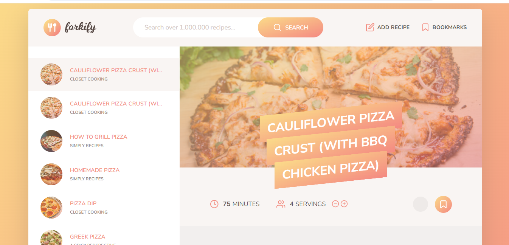

# Forkify Recipe Application

The Forkify Recipe Application is a modern web application built using JavaScript, following the Model-View-Controller (MVC) architecture. It allows users to search for recipes, view detailed information, bookmark their favorite recipes, and add new recipes.

## Features

- **Search Recipes**: Search for recipes by keywords.
- **View Recipe Details**: View detailed information including ingredients, cooking time, and servings.
- **Bookmark Recipes**: Save your favorite recipes for easy access.
- **Add New Recipes**: Upload your own recipes with ingredient validation.
- **Adjust Servings**: Dynamically adjust recipe servings and ingredient quantities.
- **Pagination**: Navigate through search results with pagination.

## Tech Stack

- **JavaScript**: Core programming language.
- **Parcel**: Bundler for building and serving the application.
- **SASS**: CSS preprocessor for styling.
- **Fractional**: Library for handling fractional quantities in ingredients.
- **Core JS**: Polyfills for modern JavaScript features.
- **Regenerator Runtime**: Support for async/await.

## Installation

1. Clone the repository:
   ```bash
   git clone https://github.com/Jatinsharma43/forkify_recipe-application.git
   ```
2. Navigate to the project directory:
   ```bash
   cd forkify_recipe-application
   ```
3. Install dependencies:
   ```bash
   npm install
   ```

## Learning Outcomes

- **MVC Architecture**: Understanding and implementing the Model-View-Controller pattern.
- **API Integration**: Fetching and uploading data to an external API using AJAX calls.
- **State Management**: Managing application state and persisting data using localStorage.
- **User Interface**: Creating a responsive and interactive UI with dynamic DOM manipulation.
- **Error Handling**: Implementing error handling and user feedback for API errors and invalid inputs.
- **Modern JavaScript**: Using ES6+ features like async/await, modules, and arrow functions.
- **Parcel Bundler**: Setting up and configuring a modern JavaScript build tool.
- **Fractional Calculations**: Implementing precise ingredient quantity adjustments using the fractional library.

## How to Use the Application

1. **Searching Recipes**:

   - Enter a keyword (e.g., "pizza") in the search bar and press Enter.
   - Browse through the results using pagination buttons.

2. **Viewing Recipe Details**:

   - Click on any recipe from the search results.
   - View the recipe's image, ingredients, cooking time, and servings.

3. **Adjusting Servings**:

   - Use the + and - buttons to increase or decrease the number of servings.
   - The ingredient quantities will automatically adjust.

4. **Bookmarking Recipes**:

   - Click the bookmark icon on any recipe to save it.
   - Access your bookmarked recipes from the bookmarks section.

5. **Adding New Recipes**:

   - Click the "Add Recipe" button.
   - Fill in the recipe details and ingredients in the specified format.
   - Upload your recipe to share it with others.

6. **Viewing Directions**:
   - Click the "Directions" button to view the full recipe instructions on the original website.

## screnshots




